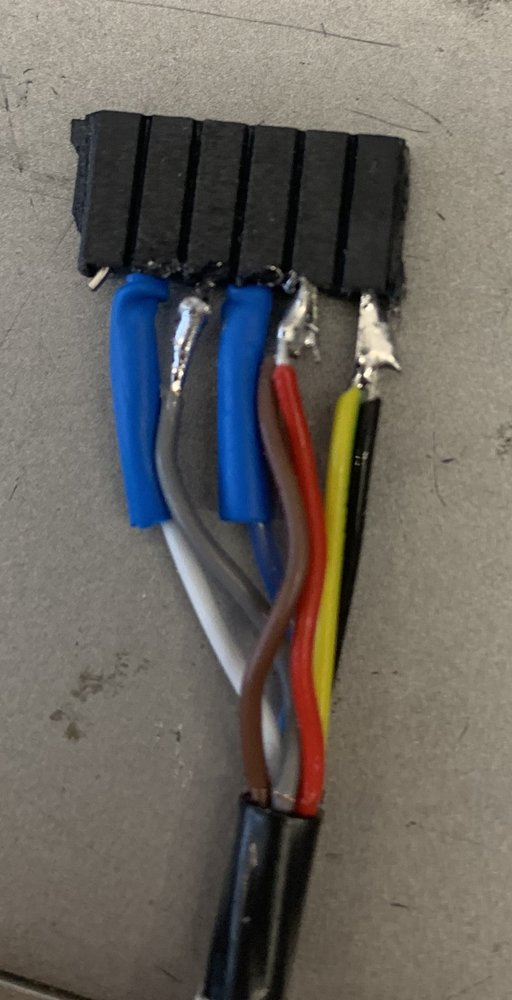

# Laboraufbau MB7574

Stand 14.09.2026. Pinheader am Sensor, Kabel auf 6-polige Buchse, die auf Pin 2–7 steckt.

| Ader | Sensor | warme Seite |
|---|---|---|
| 1 rot | Pin 6 V+ | 4-mm-Stecker Netzteil + |
| 2 gelbgrün | Pin 7 GND | 4-mm-Stecker Netzteil − |
| 3 braun | Pin 6 V+ | frei (Spannung am Sensor) |
| 4 schwarz | Pin 7 GND | FTDI schwarz, Multimeter − |
| 5 blau | Pin 5 Serial | FTDI gelb (RXD) |
| 6 grau | Pin 4 Ranging | isoliert; an GND hört der Sensor auf zu messen |
| 7 weiß | Pin 3 Analog | Multimeter +, nur bei Ausfall |

## Stecklage

Die 6-polige Buchse passt auf den 7-poligen Header auch um eine Position versetzt oder um 180° gedreht; beides legt das Netzteil auf Signalpins. Das Ende mit gelbgrün/schwarz gehört auf Pin 7 (GND). Pin 7 am Sensor und dieses Buchsenende markieren.

## Vor dem ersten Einschalten

1. Stützkondensator: 2–3 × 22 µF X7R (1210) übereinander zwischen die Lötstellen Pin 6 und Pin 7. Ohne Kondensator nur mit Vermerk im Laborbuch.
2. Lötstellen isolieren: grau, rot/braun und gelbgrün/schwarz liegen blank im 2,54-mm-Raster nebeneinander. Schrumpfschlauch je Lötstelle, darüber ein Schlauch vom Buchsenrücken bis auf den Kabelmantel als Zugentlastung.
3. Bei gestecktem Sensor Durchgang messen: Ader 1 und 3 zum Lötpunkt Pin 6 am Sensor, Ader 2 und 4 zu Pin 7.
4. FTDI TTL-232R-5V (Datenblatt Abb. 4.1): Pin 1 schwarz GND an Ader 4, Pin 5 gelb RXD an Ader 5. Einzeln isolieren: Pin 2 braun CTS#, Pin 3 rot VCC (5 V aus USB), Pin 4 orange TXD, Pin 6 grün RTS#.
5. Erstes Einschalten auf dem Tisch: 5,00 V, Strombegrenzung 150 mA, im Lauf des Tages `./kammer stufe 20 --tag tisch`. Erwartet: Kopfzeile, Werte „Rxxxx", Strom um 68 mA.

## Rechner

- Logger: `skripte/mb7574_kammerlog.py` (Python 3, pyserial), Kurzaufruf `./kammer` im Ordner `schneehoehensensor`. Findet den FTDI-Port `/dev/cu.usbserial-*` selbst. Ablauf: `../anleitungen/Kammertest_MB7574.md`.
- Daten: je Kammertest ein Laufordner `schneehoehensensor/laeufe/kammer_MB7574_<JJJJMMTT-HHMMSS>/`.
